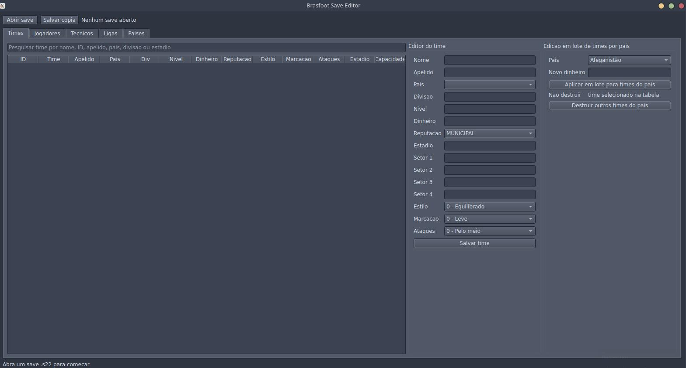
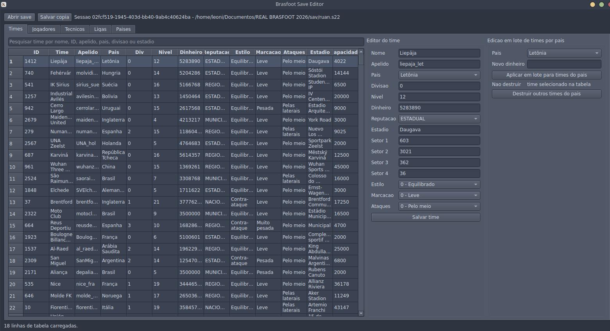
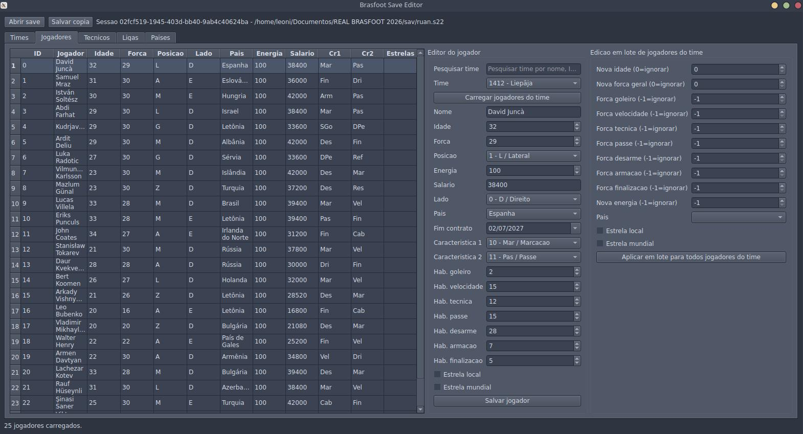

# Brasfoot Save Editor

Editor desktop para saves `.s22` do Brasfoot, construido em Java 17, Spring Boot e Qt Jambi. O projeto abre um save local, mantem os dados em uma sessao em memoria, permite editar informacoes importantes do jogo e salva uma nova copia do arquivo sem sobrescrever o save original.

## Visao Geral

O Brasfoot Save Editor nasceu para facilitar ajustes em saves do Brasfoot 2022/2023 sem depender da interface original do jogo. A aplicacao trabalha diretamente com os objetos serializados do Brasfoot por meio de Kryo e classes do jar original do jogo, expondo uma UI desktop simples para navegar e alterar times, jogadores, tecnicos, ligas e paises.

Principais objetivos do projeto:

- abrir saves `.s22` locais;
- visualizar os dados carregados em tabelas organizadas;
- editar campos ja mapeados e validados no save;
- aplicar alteracoes em lote para cenarios de teste ou customizacao;
- preservar o arquivo original ao salvar sempre uma nova copia;
- manter a regra de negocio isolada da interface por uma arquitetura em camadas/hexagonal.

## Capturas De Tela

### Tela Principal



### Dados Carregados



### Jogadores



## Funcionalidades

- Abertura de arquivos `.s22` por seletor de arquivo da interface Qt.
- Salvamento como copia no mesmo diretorio do save original, com nome gerado automaticamente.
- Listagem e filtro de times por nome, ID, apelido, pais, divisao ou estadio.
- Edicao de times: nome, apelido, pais, divisao, nivel, dinheiro, reputacao, estadio, setores do estadio e parametros taticos.
- Edicao em lote de times por pais, incluindo dinheiro e rotina para enfraquecer/destruir os outros times do mesmo pais preservando o time selecionado.
- Listagem de jogadores por time.
- Edicao de jogadores: nome, idade, forca geral, posicao, energia, salario, lado, pais, fim de contrato, caracteristicas, habilidades individuais e estrelas.
- Edicao em lote de jogadores do time selecionado: idade, forca geral, energia, pais, habilidades individuais e estrelas.
- Edicao de tecnicos: nome, time, tecnico humano, confianca da diretoria e confianca da torcida.
- Visualizacao de ligas/campeonatos e edicao de linhas da tabela: pontos, vitorias, empates, derrotas, gols pro e gols contra.
- Visualizacao e filtro de paises, com edicao do nivel/forca do pais.
- Logs estruturados em JSON Lines para diagnostico local.
- Testes de dominio, services e regras arquiteturais com ArchUnit.

## Como Funciona O Fluxo De Save

1. O usuario escolhe um arquivo `.s22` na interface.
2. O `SessionService` le o arquivo e cria uma sessao com UUID.
3. O adapter `KryoSaveAdapter` desserializa o payload usando `SaveFileService` e Kryo.
4. O estado do save fica em memoria por meio de `CurrentSessionAdapter` e `SaveContext`.
5. Os services de aplicacao alteram apenas os campos mapeados no dominio.
6. Ao salvar, o projeto serializa novamente o estado atual e grava uma copia nova no diretorio do save original.

O arquivo original nao e sobrescrito. A copia gerada segue o padrao `brasfoot-save-<uuid>.s22` ou mantem a extensao original quando ela existir.

## Arquitetura

O projeto segue uma organizacao inspirada em arquitetura hexagonal, separando dominio, casos de uso, portas, adapters e UI.

```text
src/main/java/br/com/saveeditor/brasfoot
|-- application
|   |-- ports/in      # contratos de entrada e casos de uso
|   |-- ports/out     # portas para estado, leitura, escrita e dados do jogo
|   |-- services      # orquestracao dos casos de uso
|   `-- shared        # respostas e resultados compartilhados
|-- debug             # ferramentas locais para investigacao de saves/bytecode
|-- domain            # modelos, estado do save, enums e validacoes
|-- infrastructure
|   `-- adapters      # adapters Qt, arquivo/Kryo e estado em memoria
|-- presentation      # presenter, view contract e modelos de tela
|-- service           # servicos legados/infra para Kryo e dados do jogo
`-- util              # constantes e utilitarios de reflexao/string/console
```

### Camadas Principais

- `domain`: entidades e regras do save, como `Team`, `Player`, `Manager`, `League`, `SaveContext` e enums mapeados do Brasfoot.
- `application`: services e portas que coordenam leitura, atualizacao e escrita sem depender diretamente da UI.
- `presentation`: `BrasfootPresenter`, modelos de tela e contrato `BrasfootDesktopView`.
- `infrastructure`: implementacoes concretas para Qt Jambi, Kryo e armazenamento de sessoes em memoria.
- `debug`: utilitarios para investigar saves reais, classes obfuscadas do Brasfoot e campos ainda nao confirmados.

A interface desktop e Java + Qt Jambi. O Spring Boot e usado como container de injecao de dependencias, mas a aplicacao roda com `WebApplicationType.NONE`: nao existe API REST nem frontend web.

## Tecnologias

| Tecnologia | Uso |
| --- | --- |
| Java 17 | linguagem principal |
| Spring Boot 3.2.1 | injecao de dependencias e bootstrap da aplicacao desktop |
| Qt Jambi 6.11.0 | interface grafica desktop |
| Kryo 4.0.2 | desserializacao/serializacao dos saves |
| Lombok | reducao de boilerplate em modelos |
| Gson | processamento JSON auxiliar |
| ArchUnit | validacao de regras arquiteturais nos testes |
| Logback + logstash encoder | logs estruturados em JSON Lines |
| Nix | ambiente reprodutivel de desenvolvimento |

## Requisitos

- Java 17.
- Maven.
- Qt compativel com a versao do Qt Jambi configurada no `pom.xml`.
- Linux x64 para o runtime nativo atual `qtjambi-native-linux-x64`.
- Jars locais do Brasfoot e bibliotecas auxiliares em `lib/`.

O Qt Jambi precisa usar a mesma versao major/minor/patch da Qt instalada no sistema. O projeto esta configurado para Qt Jambi `6.11.0`, e o ambiente Nix tambem prepara Qt `6.11.0`.

Arquivos locais esperados pelo `pom.xml`:

- `lib/brasfoot-game.jar`
- `lib/asm-5.1-es.jar`
- `lib/reflectasm-1.11.5.jar`
- `lib/minlog-1.3.0.jar`

## Como Executar

### Usando Ambiente Local

Execute os testes:

```bash
mvn test
```

Abra a aplicacao desktop:

```bash
mvn spring-boot:run
```

### Usando Nix

Se o ambiente local nao tiver Java, Maven ou Qt instalados, use o `shell.nix` do projeto.

Entrar no shell:

```bash
nix-shell
```

Executar testes dentro do shell:

```bash
mvn test
```

Abrir a aplicacao dentro do shell:

```bash
mvn spring-boot:run
```

Tambem e possivel executar comandos diretamente:

```bash
nix-shell --run "mvn test"
```

```bash
nix-shell --run "mvn spring-boot:run"
```

## Guia Rapido De Uso

1. Inicie a aplicacao com `mvn spring-boot:run`.
2. Clique em `Abrir save`.
3. Selecione um arquivo `.s22` do Brasfoot.
4. Aguarde o carregamento das abas de times, tecnicos, ligas e paises.
5. Selecione um registro em uma tabela para preencher o editor lateral.
6. Altere os campos desejados e clique no botao de salvar daquela area.
7. Para jogadores, escolha o time e clique em `Carregar jogadores do time`.
8. Quando terminar, clique em `Salvar copia` para gerar um novo arquivo `.s22`.
9. Teste a copia no Brasfoot antes de substituir qualquer arquivo manualmente.

## Abas Da Interface

### Times

Permite pesquisar times e editar informacoes estruturais do clube. Campos suportados incluem nome, apelido, pais, divisao, nivel, dinheiro, reputacao, estadio, setores do estadio, estilo de jogo, marcacao e foco dos ataques.

Tambem existe edicao em lote por pais para alterar dinheiro dos clubes e uma acao especifica para enfraquecer todos os outros times do pais selecionado mantendo o time marcado na tabela.

### Jogadores

Os jogadores sao carregados por time. A aba permite alterar dados basicos, contrato, caracteristicas, pais, estrelas e habilidades individuais como goleiro, velocidade, tecnica, passe, desarme, armacao e finalizacao.

A edicao em lote aplica alteracoes nos jogadores do time atualmente selecionado. Valores sentinela indicados na propria UI, como `0=ignorar` ou `-1=ignorar`, evitam alterar campos nao desejados.

### Tecnicos

Permite editar nome, time associado, flag de tecnico humano e confianca da diretoria/torcida.

### Ligas

Lista as ligas encontradas no save e permite carregar a tabela de uma liga especifica. A edicao da linha recalcula `jogos` como `vitorias + empates + derrotas` para preservar coerencia basica da tabela.

### Paises

Mostra os paises mapeados no save, com filtro por nome, grupo ou ID. Atualmente expoe a edicao do nivel/forca do pais.

## Documentacao Tecnica

- `docs/field-mapping.md`: registro dos campos confirmados por save real, bytecode e reflexao.
- `todo.md`: historico de mapeamentos e campos ainda em investigacao.
- `scripts/save-debugger.sh`: script auxiliar para depuracao local de saves.

O mapeamento de campos e uma parte sensivel do projeto porque o Brasfoot usa classes e atributos obfuscados. Por isso, novos campos devem ser confirmados com evidencia antes de serem expostos na UI.

## Logs

Os logs sao gerados em `logs/brasfoot-save-editor.jsonl`, com rotacao diaria e por tamanho. O formato e JSON Lines, facilitando busca, filtragem e diagnostico de erros.

Configuracoes principais:

- arquivo ativo: `logs/brasfoot-save-editor.jsonl`;
- historico: ate 14 dias;
- tamanho maximo por arquivo: 10 MB;
- limite total: 200 MB;
- logger do projeto em `DEBUG` por padrao via `application.properties`.

## Testes

O comando principal de verificacao e:

```bash
mvn test
```

A suite cobre:

- validacoes de dominio;
- services de times, jogadores e tecnicos;
- dados do jogo;
- regras arquiteturais com ArchUnit.

## Cuidados E Limitacoes

- Sempre mantenha backup dos saves importantes antes de testar uma copia modificada.
- O projeto salva uma copia automaticamente, mas nao valida todos os comportamentos internos do jogo apos a edicao.
- Apenas campos ja mapeados devem ser alterados; campos obfuscados sem confirmacao podem corromper o save.
- O runtime nativo configurado no Maven e Linux x64.
- A aplicacao depende dos jars locais do Brasfoot em `lib/`; sem eles a desserializacao pode falhar com erro de classe `best.*` nao encontrada.
- Este projeto nao implementa servidor web, API REST ou frontend browser.

## Troubleshooting

### Erro Sobre Qt Ou Plugin De Plataforma

Use o ambiente Nix ou confira se a Qt instalada tem a mesma versao do Qt Jambi. Em ambiente Nix, as variaveis `LD_LIBRARY_PATH`, `QT_PLUGIN_PATH` e `QT_QPA_PLATFORM_PLUGIN_PATH` ja sao configuradas pelo `shell.nix`.

### Erro `Brasfoot game classes were not loaded`

Verifique se `lib/brasfoot-game.jar` existe e esta acessivel. Esse jar e necessario para carregar classes obfuscadas do Brasfoot usadas dentro do save.

### Save Nao Abre Ou Falha Ao Desserializar

Confirme se o arquivo e realmente um save `.s22` compativel com a versao esperada do Brasfoot. Saves de outras versoes podem ter estrutura diferente.

### Aplicacao Abre, Mas Nao Mostra Dados Esperados

Veja os logs em `logs/brasfoot-save-editor.jsonl` e confira a mensagem exibida na barra inferior da janela. Alguns dados dependem de mapeamentos ja confirmados no save.

## Estrutura De Pastas

```text
.
|-- docs/                 # imagens e documentacao de mapeamento
|-- lib/                  # jars locais do Brasfoot e dependencias de runtime
|-- logs/                 # logs estruturados gerados pela aplicacao
|-- scripts/              # scripts auxiliares de debug
|-- src/main/java/        # codigo principal
|-- src/main/resources/   # configuracoes de logging e Spring
|-- src/test/java/        # testes automatizados
|-- pom.xml               # build Maven e dependencias
`-- shell.nix             # ambiente de desenvolvimento com Java, Maven e Qt
```

## Contribuicao

Antes de alterar mapeamentos do save, registre a evidencia tecnica em `docs/field-mapping.md` ou em documento equivalente. Mudancas de dominio e services devem vir acompanhadas de testes quando possivel.

Fluxo recomendado:

1. Crie ou atualize testes para o comportamento alterado.
2. Execute `mvn test`.
3. Documente novos campos mapeados.
4. Teste manualmente com uma copia de save real.

O projeto tambem possui `CODE_OF_CONDUCT.md` para orientar interacoes de contribuicao.
